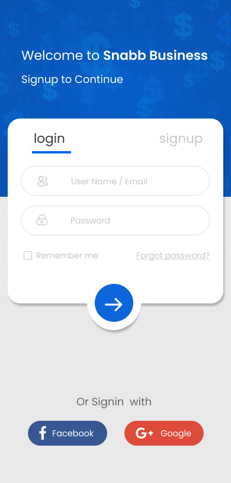
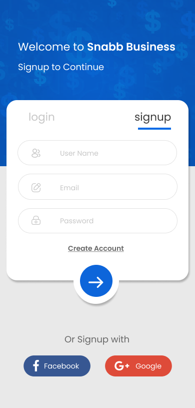
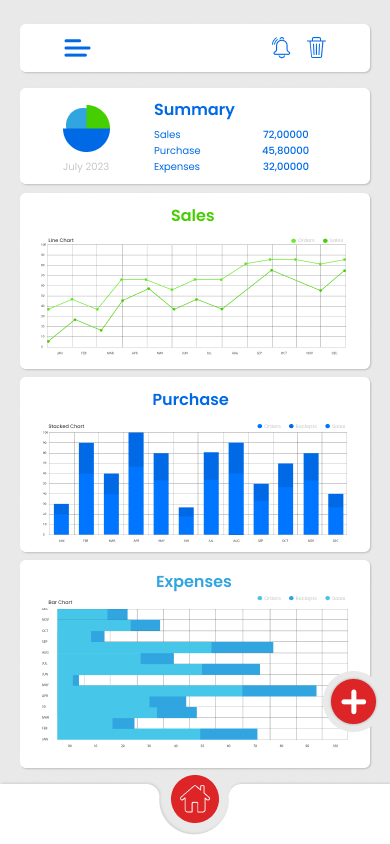
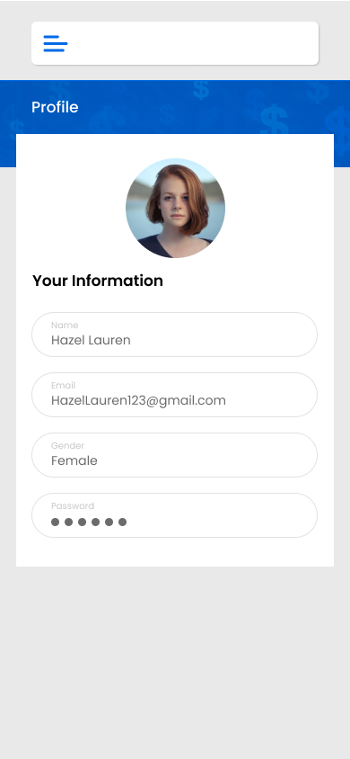
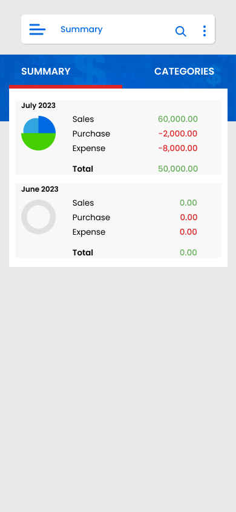

# snab_budget

<div align="center">
  <h1>
    <br/>
    snab_budget
  </h1>
  <h3>Personal & Family Budget Management App</h3>
</div>

<p align="center">
    <a href="https://github.com/" target="_blank">
        
    </a>
    <a href="APK/app-arm64-v8a-release.apk" target="_blank">
        
    </a>
    <a href="https://play.google.com/store/apps/details?id=com.sevenskiessolutions.snab_budget&hl=en_US&pli=1" target="_blank">
        
    </a>
    <a href="https://apps.apple.com/us/app/snabb-budget/id6472646712" target="_blank">
        
    </a>
    <a href="https://apkpure.com/snabb-budget/com.sevenskiessolutions.snab_budget" target="_blank">
        
    </a>
    <a href="https://web.facebook.com/profile.php?id=61553682083596#" target="_blank">
        
    </a>
</p>

---

## 📱 Official App Links & Ratings

- **Google Play:** [Snabb Budget on Google Play](https://play.google.com/store/apps/details?id=com.sevenskiessolutions.snab_budget&hl=en_US&pli=1)  
   6 reviews · 10+ downloads · Rated for 3+  
  
- **APKPure:** [Snabb Budget on APKPure](https://apkpure.com/snabb-budget/com.sevenskiessolutions.snab_budget)
- **App Store:** [Snabb Budget on App Store](https://apps.apple.com/us/app/snabb-budget/id6472646712)
- **AppAdvice:** [Snabb Budget on AppAdvice](https://appadvice.com/app/snabb-budget/6472646712)
- **Facebook:** [Snabb Budget Facebook Page](https://web.facebook.com/profile.php?id=61553682083596#)

---

## 📖 About Snabb Budget

Our expense management app provides a comprehensive solution for users to effectively manage their personal finances. With its user-friendly interface and powerful features, it empowers individuals to take control of their financial well-being.

### Key Features

- **Personal Accounts:** Create and manage multiple personal accounts (bank accounts, credit cards, cash) for accurate tracking of expenses and income across various sources.
- **Income Tracking:** Easily record income from salaries, freelance work, or investments. Categorize and track incoming funds for a clear overview of total earnings.
- **Expense Tracking:** Effortlessly record expenses in real-time, categorize them into predefined or custom categories, and add details such as amount, date, and description.
- **Statistics and Insights:** Generate detailed statistics and visualizations based on recorded income and expenses. Access comprehensive reports and graphs to understand spending patterns, income sources, and budget allocation.
- **Budget Management:** Set and manage budgets for specific categories or overall spending. Receive notifications and alerts about budget status and progress.
- **Financial Goals:** Set financial goals (saving for a vacation, paying off debts, building an emergency fund), track progress, receive reminders, and adjust spending habits accordingly.
- **Data Security:** Robust encryption methods safeguard personal information and financial transactions.

Snabb Budget is the perfect companion for individuals seeking to achieve financial stability and effectively manage their expenses. With its intuitive interface, comprehensive features, and insightful analytics, it empowers users to make informed financial decisions and work towards their financial goals.

> **References:**  
> [Google Play Store](https://play.google.com/store/apps/details?id=com.sevenskiessolutions.snab_budget&hl=en_US&pli=1) · [APKPure](https://apkpure.com/snabb-budget/com.sevenskiessolutions.snab_budget) · [AppAdvice](https://appadvice.com/app/snabb-budget/6472646712) · [App Store](https://apps.apple.com/us/app/snabb-budget/id6472646712)

---

## 📌 Overview

**snab_budget** is a comprehensive budget management app built with Flutter. It helps individuals and families track income, expenses, debts, and savings, with powerful analytics, multi-currency support, PDF export, and notifications.

## 🚀 Tech Stack

- **Flutter** (Cross-platform UI Framework)
- **Provider** (State Management)
- **Firebase** (Authentication, Firestore, Cloud Messaging)
- **PDF Generation**
- **Image Processing**
- **Local Storage** (SQLite/Shared Preferences)

## 🔑 Key Features

- ✅ **Dashboard**: Overview of balances, income, and expenses
- ✅ **Multi-Account Support**: Track multiple accounts and categories
- ✅ **Expense & Income Tracking**: Add, edit, and categorize transactions
- ✅ **Budgets**: Set monthly/yearly budgets and monitor progress
- ✅ **Debt Management**: Track creditors and debtors
- ✅ **Analytics**: Visual charts and summaries
- ✅ **PDF Export**: Export reports and summaries
- ✅ **Notifications**: Reminders for bills, budgets, and more
- ✅ **Multi-Currency**: Choose and update your preferred currency
- ✅ **User Profiles**: Manage user info and settings
- ✅ **Cloud Sync**: Sync data with Firebase
- ✅ **Dark/Light Theme**

## 📸 Banners

<div align="center">
  
  
</div>

## 📸 Screenshots

<div align="center">
  
  
  
  
  
  
  
  
  
  
  
</div>

<summary><b>📱 Complete Screenshots</b></summary>

<div align="center">
  
  
  
  
  
  
  
  
  
  
  
  
  
  
  
  
  
  
  
  
  
  
  
  
  
  
  
  
  
  
  
  
  
  
  
  
  
  
  
</div>


## 📁 Project Structure

```
lib/
├── clipper/                # Custom clippers
├── controller/             # State management providers
├── models/                 # Data models
├── Screens/                # UI screens (accounts, budget, dashboard, etc.)
├── utils/                  # Utility widgets and helpers
├── main.dart               # App entry point
```

## 📱 Download APK

You can download the latest APKs from the [APK folder](APK/) or use the links below:
- [app-arm64-v8a-release.apk](APK/app-arm64-v8a-release.apk)
- [app-armeabi-v7a-release.apk](APK/app-armeabi-v7a-release.apk)
- [app-x86_64-release.apk](APK/app-x86_64-release.apk)

## 🔧 Configuration

### Firebase Setup
1. Create a new Firebase project
2. Enable Authentication, Firestore, and Cloud Messaging
3. Download `google-services.json` and place it in `android/app/`

### Environment Variables
If needed, create a `.env` file in the root directory with your Firebase configuration:
```
FIREBASE_API_KEY=your_api_key
FIREBASE_PROJECT_ID=your_project_id
FIREBASE_MESSAGING_SENDER_ID=your_sender_id
FIREBASE_APP_ID=your_app_id
```

## 🚀 Features Overview

- **Multi-Account & Category Support**
- **Budgeting & Analytics**
- **Debt Tracking**
- **PDF Export**
- **Notifications**
- **Multi-Currency**
- **User Profiles**
- **Cloud Sync**
- **Dark/Light Theme**

## 👥 Contributors

<div align="center">
  <h3>Project Contributors</h3>
</div>

<table align="center">
  <tr>
    <td align="center">
      
      <br />
      <sub><b>Muhammad Usman</b></sub>
    </td>
    <td align="center">
      
      <br />
      <sub><b>ALI HASSAN</b></sub>
    </td>
    <td align="center">
      
      <br />
      <sub><b>Muhammad Arslan</b></sub>
    </td>
    <td align="center">
      
      <br />
      <sub><b>Muhammad Moheeb</b></sub>
    </td>
  </tr>
</table>

<div align="center">
  <h4>🌟 Special Thanks to All Contributors 🌟</h4>
  <p>This project wouldn't be possible without the dedication and expertise of our amazing team.</p>
</div>

---

<p align="center">
   Made with ❤️ by the 7 Skies solution Team using Flutter and Firebase
</p>
