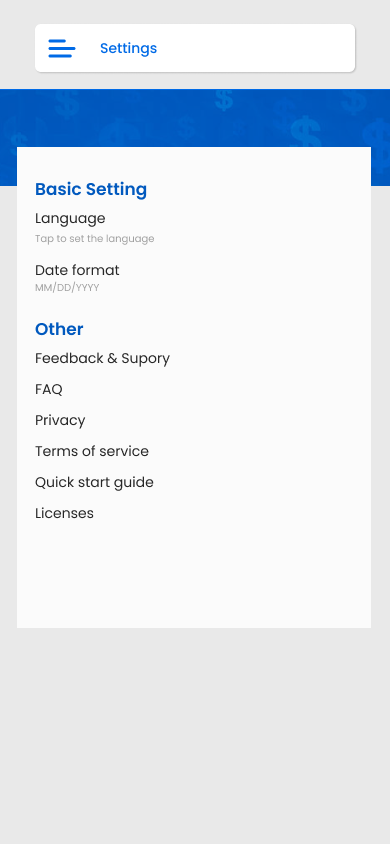

# Snab Business

<div align="center">
  <h1>
    <br/>
    Snab Business
  </h1>
  <h3>Comprehensive Business & Finance Management App</h3>
</div>

<p align="center">
    <a href="https://github.com/jamalihassan0307/Snab-Business" target="_blank">
        
    </a>
    <a href="https://www.figma.com/design/lW3oi2m6pvbBSaeAXOc95Z/Untitled?node-id=118-1681&t=yLqfK4cd0MIEq6mS-0" target="_blank">
        
    </a>
</p>

## 📌 Overview

Snab Business is a modern business and finance management application designed to help individuals and organizations manage their finances, transactions, budgets, and reports efficiently. The app provides a wide range of features including income/expense tracking, budgeting, debt management, PDF report generation, and more, all wrapped in a user-friendly and visually appealing interface.

## 🚀 Tech Stack

- **Flutter** (Cross-platform UI Framework)
- **GetX** (State Management & Navigation)
- **Firebase** (Backend Services)
- **SQLite** (Local Database)
- **PDF Generation & Viewing**
- **Image Processing & Caching**

## 🔑 Key Features

- **Dashboard**: Overview of balances, transactions, and financial health
- **Wallet Management**: Multiple wallets/accounts support
- **Income & Expense Tracking**: Add, edit, and categorize transactions
- **Budgeting**: Set monthly/yearly budgets and track progress
- **Debt/Loan Management**: Track creditors, debtors, and due dates
- **Scheduled Transactions**: Automate recurring payments or income
- **PDF Reports**: Generate and export detailed financial reports
- **Charts & Analytics**: Visualize spending, income, and trends
- **Profile & Settings**: Manage user profile, preferences, and security
- **Multi-language & Currency Support**: Choose your language and currency
- **Cloud Sync**: Optional cloud backup and restore
- **Notifications**: Alerts for due dates, budget limits, and more
- **Theme Customization**: Light/Dark mode and color themes

## 📸 Banner

<div align="center">
  
</div>

## 📸 Screenshots

### Main Screens

| Dashboard | Budgets | Wallets | Transactions |
|-----------|---------|---------|--------------|
|  |  |  |  |

| Login | Signup | Profile | Settings |
|-------|--------|---------|----------|
|  |  |  |  |

| Category | Charts | Time Chart | Line Chart |
|----------|--------|------------|------------|
|  |  |  |  |

| Loans | Scheduled Transactions | Change Password | PDF Report |
|-------|------------------------|-----------------|------------|
|  |  |  |  |

| Drawer | Drawer 1 | Due Date Alert | Home |
|--------|----------|----------------|------|
|  |  |  |  |

| New Expense | New Purchase | New Sale | Paid As |
|-------------|--------------|----------|---------|
|  |  |  |  |

| Paid As 1 | Paid As (space) | Purchase Transaction | Report |
|-----------|-----------------|---------------------|--------|
|  |  |  |  |

| Report 1 | Report 2 | Report 3 | Report 4 |
|----------|----------|----------|----------|
|  |  |  |  |

| Report 5 | Report 6 | Report 7 | Scheduled Transaction |
|----------|----------|----------|----------------------|
|  |  |  |  |

| Select Payment Method | Select Purchase Method | Select Sales Method | Signup |
|----------------------|-----------------------|---------------------|--------|
|  |  |  |  |

| Summary | Summary (categories) | Wallet | Preferances |
|---------|----------------------|--------|-------------|
|  |  |  |  |

| Expanse Transaction Page | Chat Time Filter | Pia Chart |
|-------------------------|------------------|-----------|
|  |  |  |

<details>
<summary><b>📂 Full Screenshots List (Click to expand)</b></summary>

```
screenshots/all_wallets.png
screenshots/budgets.png
screenshots/category.png
screenshots/change_password.png
screenshots/charts.png
screenshots/chat_time_fuilter.png
screenshots/dashboard.png
screenshots/drawer.png
screenshots/drawer1.png
screenshots/due_date_alert.png
screenshots/expanse_transcation_page.png
screenshots/forgot_password.png
screenshots/home.png
screenshots/line_chart.png
screenshots/loans.png
screenshots/login.png
screenshots/new_expanse.png
screenshots/new_purchase.png
screenshots/new_sale.png
screenshots/paid as.png
screenshots/paid_as.png
screenshots/paid_as1.png
screenshots/pdf_report.png
screenshots/pia_chart.png
screenshots/preferances.png
screenshots/profile.png
screenshots/purchase_transcation_page.png
screenshots/report.png
screenshots/report1.png
screenshots/report2.png
screenshots/report3.png
screenshots/report4.png
screenshots/report5.png
screenshots/report6.png
screenshots/report7.png
screenshots/scheduled_transaction.png
screenshots/select_payment_method.png
screenshots/select_purchase_method.png
screenshots/select_sales_method.png
screenshots/setting.png
screenshots/signup.png
screenshots/summary.png
screenshots/summary(categories).png
screenshots/time_chart.png
screenshots/trasactions.png
screenshots/wallet.png
```

</details>

## 🖼️ Figma Design

You can view the project design on [Figma](https://www.figma.com/design/lW3oi2m6pvbBSaeAXOc95Z/Untitled?node-id=118-1681&t=yLqfK4cd0MIEq6mS-0).

## 👥 Contributors

<div align="center">
  <h3>Meet Our Contributors</h3>
  <p>This project is made possible by the collaborative efforts of our talented developers.</p>
</div>

<table align="center">
  <tr>
    <td align="center">
      <a href="https://github.com/jamalihassan0307">
        
        <br />
        <sub><b>ALI HASSAN</b></sub>
      </a>
      <br />
      <sub>Full-Stack Developer | Flutter Expert</sub>
    </td>
    <td align="center">
      <a href="https://github.com/MoheebTech">
        
        <br />
        <sub><b>Muhammad Moheeb</b></sub>
      </a>
      <br />
      <sub>Flutter Developer Expert</sub>
    </td>
    <td align="center">
      <a href="https://github.com/muhammadarslanapax">
        
        <br />
        <sub><b>Muhammad Arslan</b></sub>
      </a>
      <br />
      <sub>Backend Developer</sub>
    </td>
    <td align="center">
      <a href="https://github.com/usmandevx">
        
        <br />
        <sub><b>Muhammad Usman</b></sub>
      </a>
      <br />
      <sub>Mobile Developer</sub>
    </td>
  </tr>
</table>

<div align="center">
  <h4>🌟 Special Thanks to All Contributors 🌟</h4>
  <p>This project wouldn't be possible without the dedication and expertise of our amazing team.</p>
</div>

## 🏗️ Project Structure

```
assets/images/           # App logos and images
contribution/            # Contributor images
screenshots/             # App screenshots
banner_snabb_busines.png # Project banner
```

## 📄 License

This project is licensed under the MIT License - see the [LICENSE](LICENSE) file for details.

---

<p align="center">
  Made with ❤️ by the 7 Skies solution Team using Flutter , APIS and Firebase
</p>

